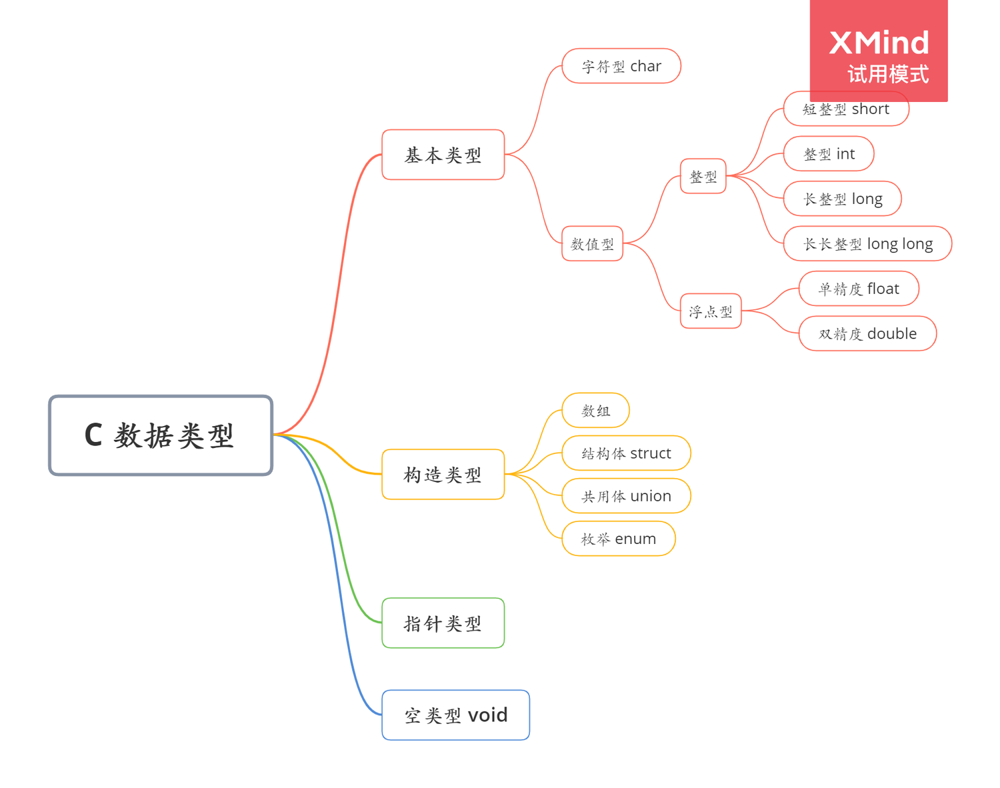

计算机中存储的数据只有 0 和 1。有人说，不对吧，我在电脑上可以看到音视频、图片啊，其实这些在我们电脑中依旧是以 0 和 1 来存储的。

**所有的数据在计算机中都是用数字 0 和 1 来表示的。**
在代码中只用 0 和 1 来表示数据，在阅读代码非常麻烦，因此 C 语言支持我们在代码中使用各种数字和字符，而不只是 0 和 1，但实际上存储在计算机中的依旧是 0 和 1。下面我们来了解一下 C 语言中的数据类型，其中本节主要讲解基本数据类型，对于其他类型则是简单说明，在熟练使用基本数据类型之后再学习其他的数据类型。

## 基本类型

这是我们今天的主角，在 C 语言的基本数据类型中有整型、浮点型、字符类型。在学习基本数据类型时，我们需要关注这些类型的关键字，占多少字节，取值范围。
### 整型
**什么是整型？**所谓整型，即没有小数的数。它又包括正整数、0、负整数，同样我们的整型数据有正有负，也有0。
C 语言提供了多种整数类型，程序员针对不同情况可以选择不同类型，一般情况使用 int 类型即可，但是为满足特定任务和机器要求，可以选择其他类型。
​

#### 整型 int
内存大小：C 语言规定，int 类型最少占 2 字节，最多不超过 long。对于 16 位编译器来说，int 是 2 字节，对于 32 位和 64 位编译器来说，int 是 4 字节。因为目前常用的是 32 位和 64 位编译器，因此一般来说 int 的范围是 [-2^31, 2^31-1]，即 [-2147483648, 2147483647]。

#### 短整型 short
内存大小：C 语言规定，short 类型最少占 2 字节，最多不超过 int。对于 16 位、32 位、64 位编译器来说，short 类型都是占 2 字节，取值范围是 [-2^15, 2^15 -1]，即 [-32768, 32767]。
​

#### 长整型 long
内存大小：C 语言规定，long 类型最少占 4 字节。对于 16 位、32 位编译器来说，long 占 4 字节，对于 64 位编译器来说，long 占 64 位。
由于 long 类型在常用的 32 位和 64 位编译器中存储的字节数不同，因此引入 long long 类型，long long 至少占 8 字节。
​

不同位数的编译器，整型数据所占字节数如下所示。

| **数据类型\编译器位数** | **16** | **32** | **64** |
| --- | --- | --- | --- |
| **short** | 2 | 2 | 2 |
| **int** | 2 | 4 | 4 |
| **long** | 4 | 4 | 8 |
| **long long** | 8 | 8 | 8 |

#### 为什么要使用多种整型?
首先，我们来看看**整型和我们平常所说的整数有什么差别？**
平常所说的整数是无限的，而整型是存储在计算机中的整数，它是有限的，是受限于计算机的存储单元的。
之所以使用多种整型，正是因为这些整型由于存储时占据的字节数不同，使得它们的取值范围不同。这样我们就可以根据需要存储的数据的范围来选择使用的整型。
​

### 浮点型
**什么是浮点型？**所谓浮点型，即有小数的数。是因为小数点的位置可以自由浮动，因此称为浮点数。例如，1.234 和 12.34，虽然他们在大小上一致，但是在存储时有所不同。
浮点型有单精度浮点数和双精度浮点数两种，所谓精度指的是能精确表示的有效数字，注意不是小数点后有效数字！！！。
#### 单精度浮点数 float
内存大小：占 4 字节。
至少能精确表示6位有效数字。
最高位为符号位，紧接着8位为指数位，剩下的23位为尾数位。
​

#### 双精度浮点数 double
内存大小：占 8 字节。
至少能精确10位有效数字。
最高位为符号位，紧接着8位为指数位，剩下的52位为尾数位。

### 字符型 char
内存大小：占 1 字节。
其本质上是 1 字节的整型。大部分编译器默认 char 类型是有符号的，不过我们常用的是 [0，127] 这一部分，实际上其取值范围是 [-128，127]。
​

## 构造类型
有的数据比较复杂，我们可能会用到结构、数组等数据形式来表示。
​

## 指针类型
C 语言的重点内容就是指针和内存管理，所以这一部分呢很重要，在后面的学习中有一章专门讲解。
