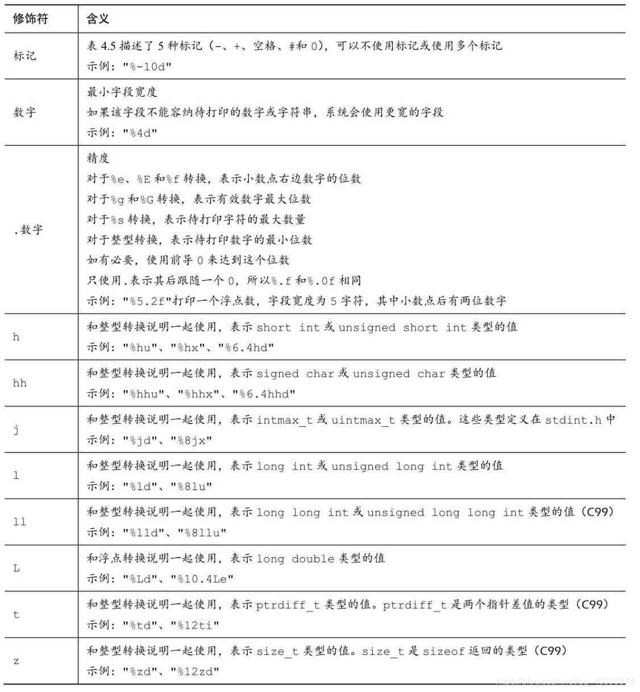
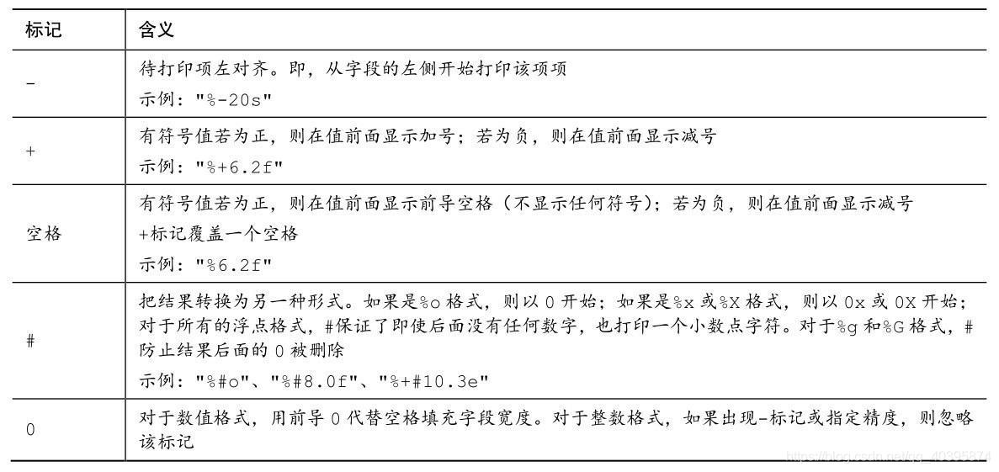
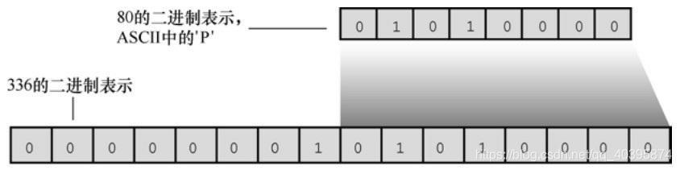
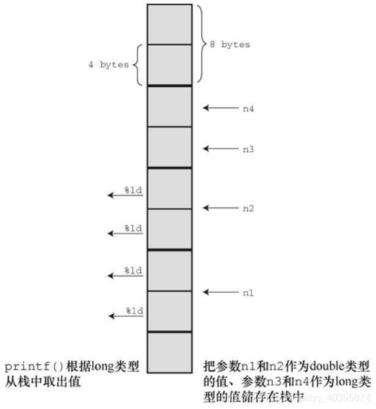
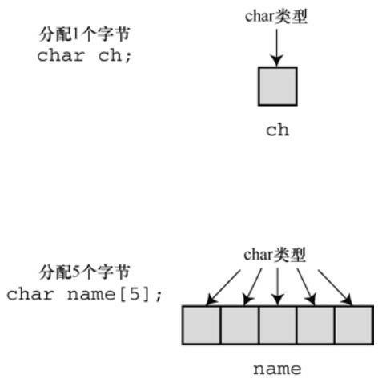

目前我们已经学习了基本数据类型，但是在使用的过程中，都是我们在代码中固定好了变量存储的值，这样很不灵活，现在期望能够在程序运行的过程中输入变量的，这就需要用到 C 语言提供的输入输出函数 scanf 和 printf 了。

# 输出数据

**语法**：`printf(格式字符串，[参数列表]);`
**注意**：使用 printf 打印数据时，待打印的数据的类型一定要和格式字符串中的转换说明相匹配！！！

例如，我们的第一个 C 语言程序输出了 Hello, World：

```c
#include <stdio.h>
int main()
{
    printf("Hello, World");
    return 0;
}
```

但是这样只能输出固定的字符串，没有办法出来变量的值输出，想要输出变量值需要使用格式转换符来占位。

## 1. 格式转换符

scanf() 和 printf() 输入输出数据时都需要使用格式转换符来进行占位。

| **格式转换符** | **说明**                          |
| -------------- | --------------------------------- |
| %d             | 有符号，十进制数                  |
| %u             | 无符号，十进制数                  |
| %o             | 八进制                            |
| %x             | 十六进制                          |
| %#o、%#x       | 带前缀的八进制和十六进制数        |
| %hd、%ho、%hx  | 十进制、八进制和十六进制的 short  |
| %ld、%lo、%lx  | 十进制、八进制和十六进制的 long   |
| %f             | float 和 double 类型浮点数        |
| %e             | 指数计数法的 float 和 double      |
| %lf            | long double 类型浮点数            |
| %.nf           | 保留小数点后n位的浮点数(四舍五入) |
| %c             | 字符                              |
| %s             | 字符串                            |
| %p             | 指针                              |
| %%             | 打印一个 % 号，相当于转义 %       |

```c
#include <stdio.h>
int main(void)
{
    int a = 17;
    double b = 5.5;
    char c = 'A';
    printf("a=%d, b=%f, c=%c", a, b, c);
    printf("十进制:a=%d, 八进制:a=%o, 十六进制:a=%x", a, a, a);
    return 0;
}
```

```
// 输出结果：
a=17, b=5.500000, c=A
十进制:a=17, 八进制:a=21, 十六进制:a=11
```

## 2. 格式化输出

printf() 可以对输出进行格式化控制。例如，可以控制浮点数小数点后的位数等。




`数字` 表示最小字段宽度。如果需要打印的数据宽度小于该数字，那么在前面自动补空格；如果需要打印的数据宽度大于等于该数字，正常打印。默认是右对齐的，搭配 - 表示左对齐。搭配 0 表示不足补 0，而不是空格。


```c
#include <stdio.h>
int main()
{
    int i = 100;
    printf("*%d*\n",i);
    printf("*%6d*\n",i);
    printf("*%-6d*\n",i);
    printf("*%06d*\n",i);
    getchar();
    return 0;
}
```


```c
// 输出结果：
*100*
*   100*
*100   *
*000100*
```

`.数字` 表示精度。对于浮点数来说，精度就是显示小数点后几位，如果浮点数小数点后位数比这个数字小，则补零；如果浮点数小数点后面位数比这个数字大，则四舍五入。对于整型数来说，精度就是待打印的数据的最小位数，如果待打印数据位数不足，前面补零。
PS:如果 0 标记和精度一起出现，0 标记会失效。


```c
printf("*%06.4d*\n",i);// 0标记失效，输出*  0100*
```


## 3. 转换说明


转换说明把以二进制格式储存在计算机中的值转换成一系列字符（字符串）以便于显示。例如，数字76在计算机内部的存储格式是二进制数 01001100。%d 转换说明将其转换成字符 7 和 6，并显示为 76；%x 转换说明把相同的值（01001100）转换成十六进制记数法 4c；%c 转换说明把 01001100 转换成字符 L。


1. 整数类型的转换说明不匹配
1. 浮点数类型的转换说明不匹配

```c
// 转换说明不匹配示例1
short j = -336;
// 将一个负数打印为无符号 short int 类型，输出结果是65200
printf("%hu\n",j);
```


```c
// 转换说明不匹配示例2
int k = 336;
// 将大于256的数打印为 char 类型，输出结果是 P，其 ASCII 是 80
printf("%c\n",k);
```





```c
// 转换说明不匹配示例3
float  n1 = 3.0;
double n2 = 3.0;
long   n3 = 2000000000;
long   n4 = 1234567890;
// 将 long 类型数据n3和n4打印为 double 类型数据。
printf("%.1e %.1e %.1e %.1e\n", n1, n2, n3, n4);
// 将 double 类型数据n1和n2打印为 long 类型数据。
printf("%ld %ld %ld %ld\n", n1, n2, n3, n4);
```


```
// 打印为e计数的浮点数
3.0e+000 3.0e+000 3.1e+46 1.7e+266
// 打印为 long 类型数据
0 1074266112 0 1074266112
```


> 具体情况因编译器实现而异。这个结果是《C Prime Plus》中的结果，我在 Windows 下运行的结果是 0 0 2000000000 1234567890，在 Ubuntu 下运行的结果会报错，它严格要求转换说明是匹配的，不允许输出格式是 long 类型，而参数是 double 类型的。

如果printf()语句有其他不匹配的地方，即使用对了转换说明也会生成虚假的结果。用%ld转换说明打印浮点数会失败，但是在这里，用 %ld 打印 long 类型的数竟然也失败了！
**解释**：该调用告诉计算机把变量n1、n2、、n3和n4的值传递给程序。这是一种常见的参数传递方式。程序把传入的值放入被称为栈（stack）的内存区域。 计算机根据变量类型（不是根据转换说明）把这些值放入栈中。因此，n1被储存在栈中，占8字节（float类型被转换成double类型）。同样，n2也在栈中占8字节，而n3和n4在栈中分别占4字节。然后，控制转到printf()函数。该函数根据转换说明（不是根据变量类型）从栈中读取值。%ld转换说明表明 printf()应该读取4字节，所以printf()读取栈中的前4字节作为第1个值。这是 n1的前半部分，将被解释成一个long类型的整数。根据下一个%ld转换说 明，printf()再读取4字节，这是n1的后半部分，将被解释成第2个long类型的 整数（见图4.9）。类似地，根据第3个和第4个%ld，printf()读取n2的前半部分和后半部分，并解释成两个long类型的整数。因此，对于n3和n4，虽然用对了转换说明，但printf()还是读错了字节。





## 4. printf() 的返回值


printf() **返回打印的字符的个数**，如果输出有错误，则 printf() 返回一个负值。


> printf() 的返回值是其打印输出功能的附带用途，通常很少用到，但在检查输出错误时可能会用到（如，在写入文件时很常用）。
>
> 注意计算输出的字符个数是针对所有的字符，包括空格和不可见的换行符（\n）。

## 5. 打印较长字符串时的断行


1. 方法1：使用多个printf()语句。
1. 方法2：用反斜杠（\）和 Enter（或Return）键组合来断行。PS：下一行代码必须从**最左边**开始，如果有缩进，那么缩进的这些空格都会成为字符串的一部分。
1. 方法3：ANSI C引入的字符串连接。在两个用双引号括起来的字符串之 间用空白隔开，C编译器会把多个字符串看作是一个字符串。

```c
// 方法1
printf("Here's one way to print a "); 
printf("long string.\n"); 
// 方法2
printf("Here's another way to print a \ 
long string.\n"); 
// 方法3
printf("Here's the newest way to print a " 
"long string.\n"); // ANSI C
```

# 输入数据

## 1. 用法

C 语言的库中有多个输入函数，scanf() 是最通用的一个，因为它可以读取不同格式的数据。

scanf() 把输入的字符串转换成整数、浮点数、字符或字符串，而 printf() 正好与它相反，把整数、浮点数、字符和字符串转换成显示在屏幕上的文本。

scanf() 和 printf() 主要的区别在参数列表中，printf() 函数使用变量、常量和表达式，而 scanf() 函数使用指向变量的指针。

如果不了解指针，可以简单的记住下面的两条规则：

1. 如果用scanf()读取基本变量类型的值，在变量名前加上一个&；
1. 如果用scanf()把字符串读入字符数组中，不要使用&。

scanf() 函数所用的转换说明与 printf() 函数几乎相同。主要的区别是，对于 float 类型和 double 类型，printf()都使用%f、%e、%E、%g 和 %G 转换说明。而 scanf() 只把它们用于 float 类型，对于 double 类型时要使用 l 修饰。

## 2. scanf() 读取输入的过程

假设 scanf() 根据一个 %d 转换说明读取一个整数。

1. scanf() 函数每次读取一个字符，跳过所有的空白字符，直至遇到第1个非空白字符才开始读取。
   PS：因为要读取整数，所以 scanf() 希望发现一个数字字符或者一个符号(+或-)。
1. 如果找到一个数字或符号，它便保存该字符，并读取下一个字符。
1. 如果下一个字符是数字，它便保存该数字并读取下一个字符。scanf()不断地读取和保存字符，直至遇到非数字字符。
1. 如果遇到一个非数字字符，它便认为读到了整数的末尾。然后， scanf()把非数字字符放回输入。这意味着程序在下一次读取输入时，首先读到的是上一次读取丢弃的非数字字符。
1. 最后，scanf() 计算已读取数字（可能还有符号）相应的数值，并将计算后的值放入指定的变量中。

>  如果使用字段宽度，scanf()会在字段结尾或第1个空白字符处停止读取 （满足两个条件之一便停止）。

**Q**：如果第1个非空白字符是 A 而不是数字，会发生什么情况？
**A**：scanf() 将停在那里，并把 A 放回输入中，不会把值赋给指定变量。程序在下一次读取输入时，首先读到的字符是 A。如果程序只使用 %d 转换说明， scanf() 就一直无法越过 A 读下一个字符。另外，如果使用带多个转换说明的 scanf()，C规定在第1个出错处停止读取输入。


用其他数值匹配的转换说明读取输入和用 %d 的情况相同。区别在于 scanf() 会把更多字符识别成数字的一部分。


如果使用 %s 转换说明，scanf()会**读取除空白以外的所有字符**。scanf() 跳过空白开始读取第 1 个非空白字符，并保存非空白字符直到再次遇到空白。 **这意味着 scanf() 根据 %s 转换说明读取一个单词**，即不包含空白字符的字符串。如果使用字段宽度，scanf() 在字段末尾或第1个空白字符处停止读取。**无法利用字段宽度让只有一个 %s 的 scanf() 读取多个单词**。最后要注意一点：**当scanf()把字符串放进指定数组中时，它会在字符序列的末尾加上'\0'，让数组中的内容成为一个C字符串**。

## 3. 格式字符串的普通字符

scanf() 函数允许把普通字符放在格式字符串中。除空格字符外的普通字符必须与输入字符串严格匹配。例如，假设在两个转换说明中添加一个逗号：`scanf("%d,%d", &n, &m);` scanf() 函数将其解释为：用户将输入一个数字、一个逗号，然后再输入一个数字。也就是说，用户必须像`88,121`这样输入两个整数。


## 4. scanf() 的返回值

scanf() 函数返回成功读取的项数。如果没有读取任何项，或需要读取一个数字而用户却输入一个非数值字符串，scanf() 便返回0。当 scanf() 检测到“文件结尾”时，会返回EOF（EOF是stdio.h中定义的特殊值，通常用 #define 指令把EOF 定义为 -1）。

## 5. 跳过输入项

把\*放在%和转换字符之间时，会使得 scanf() 跳过相应的输入项。


```c
#include <stdio.h>
int main()
{
    int n;
    printf("Please enter there integers:\n");
    scanf("%*d %*d %d",&n);
    printf("n is %d\n",n);
    return 0;
}
```


输入：2019 2020 2021
输出：n is 2021


在程序需要读取文件中特定列的内容时，这项跳过功能很有用。

# 字符的输入输出

虽然，printf() 和 scanf() 提供了相应的格式转换符，但一般对于字符的输入输出往往采用 getchar() 和 putchar() 这两个函数，它们和 printf() 和 scanf() 一样，都位于 \<stdio.h> 文件中，每次只处理一个字符。

你可能认为每次只能处理一个字符实在太笨拙了，毕竟与我们的阅读方式相差甚远。但是，这种方法很适合计算机，而且，这是绝大多数文本（普通文字）处理程序所用的核心方法。


## 1. 缓冲区
### 1.1. 示例
编写一个示例程序，要求程序获取从键盘输入的字符，并将这些字符发送到屏幕上，以 # 字符结束。
```c
#include <stdio.h> 
int main(void) 
{
	char ch; 
	while ((ch = getchar()) != '#') 
		putchar(ch); 
	return 0; 
}
```
> PS: getchar() 和 putchar() 其实都不是真正的函数，而是定义为供预处理器使用的宏。

```
// 输出
Hello, there. I would[enter]
Hello, there. I would 
like a #3 bag of potatoes.[enter] 
like a
```
如果是在一些老式系统中运行，可能出现下面的现象

```
HHeelllloo,, tthheerree.. II wwoouulldd[enter] 
lliikkee aa #
```
### 1.2. 概念

**无缓冲输入：** 像用户输入的字符后立即重复打印该字符是属于无缓冲输入，即正在等待的程序可立即使用输入的字符。
**缓冲输入：** 对于该例，大部分系统在用户按下 Enter 键之前不会重复打印刚输入的字符，这种输入形式属于缓冲输入。用户输入的字符被收集并储存在一个被称为缓冲区（buffer）的临时存储区，按下Enter键后，程序才可使用用户输入的字符。


### 1.3. 用处

**Q：为什么要有缓冲区？**
**A：1. 将若干字符作为一个块进行传输比逐个发送这些字符节约时间；2. 如果用户打错字符，可以直接通过键盘输入修正错误，当按下 Enter 键时，传输的时正确的输入。**


虽然缓冲输入好处很多，但是某些交互式程序也需要无缓冲输入。例如，在游戏中，你希望按下一个键就执行相应的指令(如释放技能)。因此，缓冲输入和无缓冲输入都有用武之地。


### 1.4. 缓冲分类

**缓冲分为两类：完全缓冲I/O和行缓冲I/O。**


       1. **完全缓冲I/O** 指的是当缓冲区被填满时才刷新缓冲区（内容被发送至目的地），通常出现在文件输入中。缓冲区的大小取决于系统，常见的大小是 512  字节和 4096 字节。
       2. **行缓冲I/O** 指的是在出现换行符时刷新缓冲区。键盘输入通常是行缓冲输入，所以在按下 Enter 键后才刷新缓冲区。


## 2. 结束键盘输入

文件是存储器中储存信息的区域。通常文件都保存在某种永久存储器中(如，硬盘、U 盘等)。
不同的系统的文件是有差异的。比如，在处理文件方面，有些系统使用单个换行符标记行末尾，而其他系统可能使用回车符和换行符的组合来表示行末尾。使用标准 I/O 包，就不需要考虑这些差异。

从概念上看，C 程序处理的是流而不是直接处理文件。流（stream）是一个实际输入或输出映射的理想化数据流。这意味着不同属性和不同种类的输入，由属性更统一的流来表示。于是，打开文件的过程就是把流与文件相关联，而且读写都通过流来完成。
C 把输入和输出设备视为存储设备上的普通文件，尤其是把键盘和显示设备视为每个C程序自动打开的文件。stdin 流表示键盘输入，stdout 流表示屏幕输出。getchar()、putchar()、printf() 和 scanf() 函数都是标准 I/O 包的成员，处理这两个流。因此可以用处理文件的方式来处理键盘输入。


### 2.1. 文件的末尾


计算机操作系统要以某种方法判断文件的开始和结束，检测文件结尾的方法有两种：1. 在文件末尾放一个特殊字符来标记文件结尾。曾经操作系统使用的唯一标识是 Ctrl + Z 字符。2. 另一种方法是储存文件大小的信息。


无论操作系统实际上使用的是何种方法检测文件结尾，在 C 语言中，用 getchar() 读取文件检测到文件结尾时将放回一个特殊值，即 EOF (End Of File 的缩写)。scanf()函数检测到文件结尾时也返回EOF。通常， EOF定义 在stdio.h文件中：`#define EOF (-1)`


> EOF 什么是-1？
> 因为getchar()函数的返回值通常都介于0～127，这些值对应标准字符集。但是，如果系统能识别扩展字符集，该函数的返回值可能在 0～255 之间。无论哪种情况，-1都不对应任何字符，所以，该值可用于标记文件结尾。
> 某些系统也许把EOF定义为-1以外的值，但是定义的值一定与输入字符 所产生的返回值不同。

**EOF 是一个值，标志着检测到文件结尾，并不是在文件中找得到的符号。**


### 2.2. 使用 EOF


如何在程序中使用EOF？把 getchar() 的返回值和 EOF 作比较。如果两值不同，就说明没有到达文件结尾。也就是说，可以使用下面这样的表 达式：`(ch = getchar()) != EOF`

# 字符串

在前面的介绍中，我们碰到了字符串这一概念，这里简单的介绍一下字符串。字符串（character string）是一个或多个字符的序列，如： "Zing went the strings of my heart!" 
注意：<font color="blue">双引号不是字符串的一部分。双引号仅告知编译器它括起来的是字符串，正如单引号用于标识单个字符一样</font>。 

## 1. char 类型数组和 null 字符

C 语言没有专门用于储存字符串的变量类型，字符串都被储存在 char 类型的数组中。
PS：C++ 提供了 string 类型来存储字符串。

**那么，什么是数组？**数组由连续的存储单元组成，可以把数组看作是一行连续的多个存储单元。用更正式的说法是，数组是同类型数据元素的有序序列。通过以下声明创建了一个包含40个存储单元（或元素）的数组，每个单元储存一个 char 类型的值：

```c
char name[40];
```

name 后面的方括号表明这是一个数组，方括号中的 40 表明该数组中的元素数量。char 表明每个元素的类型。

​

了解了什么是数组之后，我们再来看字符串。字符串中的字符被储存在相邻的存储单元中，每个单元储存一个字符。 


注意上图中数组末尾位置的字符 \0。这是空字符（null character），C 语言用它标记字符串的结束。<font color = "red">空字符不是数字 0！它是非打印字符，其 ASCII 码值是（或等价于）0。C 中的字符串一定以空字符结束，这意味着数组的容量必须至少比待存储字符串中的字符数多1</font>。因此，前面定义的 name 中有 40 个存储单元的字符串，只能储存 39 个字符，剩下一个字节留给空字符。 
​

### 字符串和字符数组的辨析


刚开始接触字符串的时候，很容易搞不清楚字符串和字符数组的区别。
字符串是以空字符(\0)结尾的字符数组，这意味字符串是特殊的字符数组，是字符数组的子集。

```c
char name1[5] = {'y', 'o', 'u', 'k', 'a'};
char name2[6] = {'y', 'o', 'u', 'k', 'a', '\0'};
```

如上所示，name1 是字符数组，因为它不是以空字符 \0 结尾，而 name2 是字符串。


**小结：字符串是特殊的字符数组，字符数组不一定是字符串。**


字符串看上去比较复杂！必须先创建一个数组，把字符串中的字符逐个放入数组，还要记得在末尾加上一个\0。还好，计算机可以自己处理这些细节，我们可以使用双引号 "" 来告知编译器这是一个字符串，编译器会自动在其尾部添加上空字符 \0。

## 2. 使用字符串

使用字符串其实很简单，例如：

```c
#include <stdio.h>
#define PRAISE "You are an extraordinary being." 
int main(void) 
{
    char name[40]; 
    printf("What's your name? "); 
    scanf("%s", name); 
    printf("Hello, %s.%s\n", name, PRAISE); 
    return 0; 
}
```

%s 告诉 printf() 打印一个字符串。%s 出现了两次，因为程序要打印两个字符串：一个储存在 name 数组中；一个由 PRAISE 来表示。

```xml
// 上面程序输出结果：
What's your name? Angela Plains 
Hello, Angela.You are an extraordinary being.
```

你不用亲自把空字符放入字符串末尾，scanf() 在读取输入时就已完成这项工作。也不用在字符串常量 PRAISE 末尾添加空字符。编译器会在末尾加上空字符。
**注意：使用 scanf() 读取字符串，在遇到第一个空白(空格、制表符、换行符)时不再读取输入。**所以上面的结果中只读取了 Angela，没有将 Plains 也读取。
