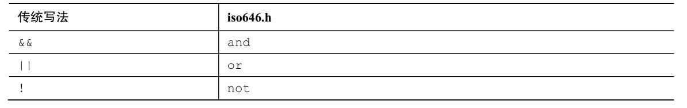

# 运算符优先级

| **优先级** | **运算符类别**  | **运算符**                                             | **结合性** |
| ---------- | --------------- | ------------------------------------------------------ | ---------- |
| 1          | 括号和 .、->    | ()、[]、.                                              | 从左到右   |
| 2          | 一元运算符      | +、-、++、--、*、&、!、~、sizeof                       | 从右到左   |
| 3          | 算术运算符      | *、/、%                                                | 从左到右   |
| 4          | 算术运算符      | +、-                                                   | 从左到右   |
| 5          | 位移运算符      | <<、>>、>>>                                            | 从左到右   |
| 6          | 比较运算符      | <、<=、>、>=、instanceof                               | 从左到右   |
| 7          | 比较运算符      | !=、==                                                 | 从左到右   |
| 8          | 位运算符(除了~) | &、\|、^                                               | 从左到右   |
| 9          | 逻辑运算符      | &&、\|\|                                               | 从左到右   |
| 10         | 三元运算符      | ?:                                                     | 从右到左   |
| 11         | 赋值运算符      | =、*=、/=、%=、+=、-=、&=、\|=、~=、^=、<<=、>>=、>>>= | 从右到左   |

> 重点：自增和自减运算符的使用。

# 算术运算符

加(+)、减(-)、乘(*) 这三个运算符没有什么可说的，跟数学中的运算没什么差别，主要讲一下两个除法运算符。

### 1. / 运算符

如果操作数都是整数，则结果为舍弃小数位的正数。例如，3 / 2 的结果为 1，而不是 1.5。

如果操作数中有一个数为浮点数，则结果为浮点数。例如，3.0 / 2 的结果为 1.5。

### 2. % 运算符

1. <font color = "red">% 求模运算符只能用于整数，不能用于浮点数</font>。

2. <font color = "red">负数求模，趋零截断。如果第一个运算对象是负数，那么求模的结果是负数，反之，结果是整数</font>。

   例如，11 % 5 = 1，11 % -5 = 1，-11 % 5 = -1，-11 % -5 = -1。

3. <font color = "red">只要 a 和 b 都是整数值，那么就可以通过</font><font color="blue"> a - (a/b)*b </font><font color="red">来计算</font><font color = "blue"> a%b</font>。

# 自增自减运算符

## ++ a 和 a ++
**++ a 是先加一再运算，a ++ 是先运算再加一。**
```c
// 示例1
int a1 = 1;
int a2 = 1;
int b1 = 10 + a1++;
int b2 = 10 + ++a2;
printf("b1=%d\n", b1);// 输出b1=11
printf("b2=%d\n", b2);// 输出b2=12
```
```c
// 示例2
int n = 0;
n = n++;
printf("n=%d\n",n);// 输出 n=0
```
示例 2 的过程：
1. 首先将 n 的值读取到寄存器中，即将 n=0 保存在寄存器中；
2. 然后在内存中将 n 的值修改为 n + 1，即此时存储变量 n 的内存中保存的是 1；
3. 最后从寄存器中读取寄存器中 n 的值，并进行运算，即将 n = 0 赋值给变量 n。

所以输出的结果是 n=0。

如果是 ++ a，先改变内存中 a 的值，然后读取到寄存器中，最后从寄存器中读取 a 的值，并进行运算。
## 优势
1. 通常由自增和自减运算符生成的机器语言代码效率更高，因为它是和实际的机器语言指令很相似。尽管如此，随着商家推出的C编译器越来越智能，这一优势可能会消失。
2. 可以使程序更加简洁。比如可以将控制循环的循环条件和循环变量的修改集中在一起。
## 注意事项
1. 如果变量出现在函数的多个参数中了，最好不要使用自增和自减运算符；
2. 如果变量在某个表达式中出现多次，最好不要使用自增和自减运算符；
3. 如果使用 a 和 a 会得到不同的结果，那么最好不要那样使用。

第1，2条是因为随着编译器的不同，可能会出现不同的结果。比如 `int n = 2;printf("%d %d",n,n*n++);`，在某些系统上是打印 n\*n，然后将 n 递增1，也就是 `2 4`；但在另一些系统中，打印出来的结果就是 n\*(n+1)，也就是`3 6`。
对于第3条，比如`int i = 0; int a = i++;`，在这里使用 i++ 的话，a 是 0，使用 ++i 的话，a 是 1，因此不推荐这么写，推荐写为`int i = 0; i++; int a = i;`

# 位移运算符

左移一位相当于×2，右移一位相当于÷2。

# 位运算符

& 和 | 是位运算符，但是也可以用来作为逻辑判断，但是与 &&、|| 不同的是，& 和 | 没有短路现象，这也是因为 & 和 | 进行逻辑判断时依旧是在进行位运算。

# 逻辑运算符

## 1. 短路现象

**短路现象**：当左边的表达式已经能决定整个表达式的真假时，不会去运行右边的表达式的现象被称为短路现象。

<font color="red">&& 和 || 都有短路现象</font>。

```c
int a = 1, b = 0;
if (a++ || --b);
printf("a=%d, b=%d\n", a, b);// 输出 a=2, b=0
int c = 0, d = 0;
if (c++ || d--);
printf("c=%d, d=%d\n", c, d);// 输出 c=1, d=-1
```

## 2. 备选逻辑运算符

C 是在美国用标准美式键盘开发的语言。但是在世界各地，并非所有的 键盘都有和美式键盘一样的符号。因此，C99标准新增了可代替逻辑运算符 的拼写，它们被定义在ios646.h头文件中。如果在程序中包含该头文件，便可用and代替&&、or代替||、not代替!。



# 三元运算符

A ? B:C —— 当 A 成立时，结果为 B；当 A 不成立时，结果为 C。

```c
int a = 3, b = 5;
int c = a > b ? a : b;// 取 a 和 b 中的较大值赋值给 c
```

# 赋值运算符

1. = 和 == 是完全不同的。
2. 赋值表达式的结果是表达式右侧的值。
3. 赋值运算符可以和算术运算符等组合。例如 a -= b 等价于 a = a - b。

# 逗号运算符

逗号运算符最常用的地方是 for 循环中。

**逗号运算符的性质：**

1. **被逗号分隔的表达式从左往右求值。** 即逗号是一个序列点，所以逗号左侧项的副作用(也就是执行)都在程序执行右侧项之前发生。
2. **整个逗号表达式的值是右侧项的值。**

```c
// 例1 —— 性质1
int a, b;
a = 1;
a++, b = a * 2; // b = 4;
```

```c
// 例2 —— 性质2
int x,y,z;
x = (y=3, (z=++y+2)+5);
printf("%d\n",x);// 输出 11
```

```c
// 例3 —— 性质2
int a = (250,251); // a 的值是 251.
```

例2和例3了解就行，写还是不要写出这样了，会被打死的。


PS：`int a, b;` 和 `printf("%d %d\n",a,b);` 中的`,`都是分割符，而不是逗号运算符。

# sizeof 运算符

<font color="red">sizeof 运算符以字节为单位返回运算对象的大小</font>（在C中，1字节定义为char类型占用的空间大小。过去，1 字节通常是 8 位，但是一些字符集可能使用更大的字节）。<font color="red">运算对象可以是具体的数据对象（如，变量名）或类型</font>。如果运算对象是类型（如，float），则必须用圆括号将其括起来。

```c
#include <stdio.h>
int main(void) 
{
    int n = 0; 
    size_t intsize; 
    intsize = sizeof (int); 
    printf("n = %d, n has %zd bytes; all ints have %zd bytes.\n", n, sizeof n, intsize); 
    return 0; 
}
```

C 语言规定，sizeof 返回 size_t 类型的值。这是一个无符号整数类型，但它不是新类型。前面介绍过，size_t是语言定义的标准类型。C 有一个 typedef 机制，允许程序员为现有类型创建别名。C 头文件系统可以使用 typedef 把 size_t 作为 unsigned int 或 unsigned long 的别名。这样，在使用 size_t 类型时，编译器会根据不同的系统替换标准类型。 


<font color="red">如果 sizeof 运算符作用于数组，得到的是整个数组占的字节数；如果 sizeof 运算符作用于数组元素，则得到的将是数组元素占的字节数；如果 sizeof 运算符作用于指针，则得到指针占的字节数 —— 32 位系统为 4 字节，64 位系统为 8 字节</font>。

```c
// 64 位系统
int arr[10];
int* p = arr;
printf("sizeof(arr)=%d\n", sizeof(arr));// 输出：sizeof(arr)=40
printf("sizeof(arr[0])=%d\n", sizeof(arr[2]));// 输出：sizeof(arr)=4
printf("sizeof(p)=%d\n", sizeof(p));// 输出：sizeof(p)=8
```


易错点：函数参数中的数组其实是指针。

```c
void f(int arr[]) {
	printf("sizeof(arr)=%d\n", sizeof(arr));
}
int main(void) {
    int arr[10] = {};
    f(arr); // 输出：sizeof(arr)=8
    return 0;
}
```