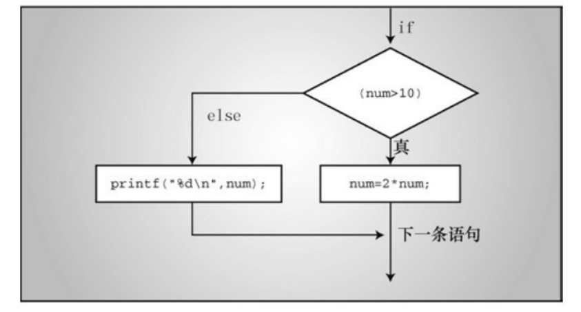
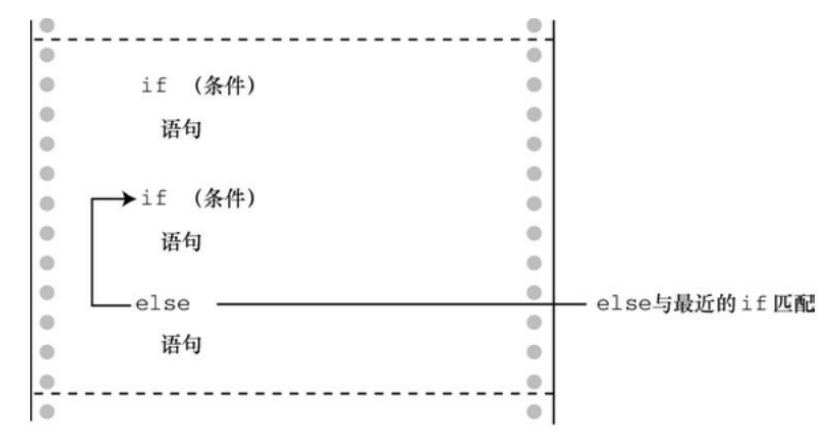
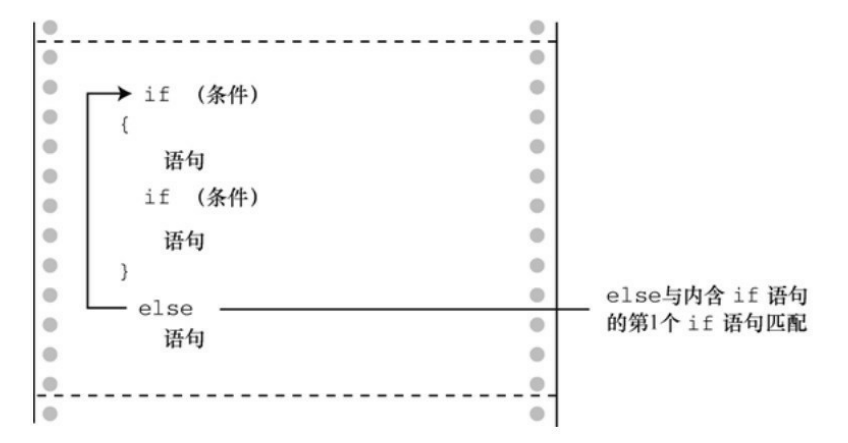
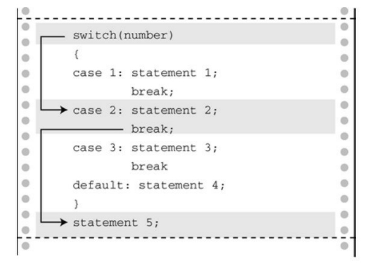
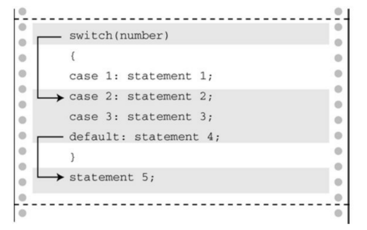

本章介绍的关键字：if、else、switch、case、continue、break、default、goto。

大多数人都希望自己是体格强健、天资聪颖、多才多艺的能人。虽然有时事与愿违，但至少我们用 C 能写出这样的程序。诀窍是控制程序流。对于计算机科学（是研究计算机，不是用计算机做研究）而言，一门语言应该提供以下3种形式的程序流：

- 自上而下顺序执行语句序列(顺序结构)； 
- 通过测试，选择执行哪一个语句序列(分支结构)；

- 如果满足某些条件就重复执行语句序列(循环结构)；


第一种形式，大家应该已经很熟悉了，在前面学习的程序就是这种形式，程序自上而下一次执行每一条语句序列。本章讲解的分支结构是第二种形式，下一章介绍的循环结构是第三种形式。

**什么是分支结构？**

**分支结构用于在不同的执行方案之间进行选择**，让程序更“智能”，且极大地提高了计算机的用途，让程序根据测试条件执行相应的行为。另外，本章还将复习 C 语言的逻辑运算符，分支结构和循环结构是逻辑运算符的主要应用场景，逻辑运算符能在if 的条件中测试更多关系。学完本章后，读者就可以设计按自己期望方式运行的程序。

# if 语句

## 1. 最简单的 if 语句

if 语句可以根据是否满足一些条件来决定某些语句序列是否执行。


### 示例

输入一个整数，输出其绝对值的程序：

```c
int n;
scanf("%d", &n);
if (n < 0)
    n = -n;
printf("%d\n", n);
```

在上面的程序中，输入 -1，程序进行到 if 语句处进行判断，-1 < 0 结果为 true，执行 { } 内容使得 n = 1，结果为 1。如果输入 1，程序进行到 if 语句处进行判断，1 < 0 结果为 false，不执行 { } 内容 n 的值依旧是 1。

### 语法

if 语句的通用形式如下：

```c
if (expression) 
	statement
```

if　语句被称为分支语句（branching statement）或选择语句（selection statement），因为它相当于一个交叉点，程序要在两条分支中选择一条执行。

如果对 expression 求值为真（非0），则执行 statement；否则，跳过 statement。statement 可以是一条简单语句或复合语句。

绝大多数情况下，expression 是关系表达式，即比较两个量的大小（如，表达式 x > y 或 c == 6）。如果 expression 为真（即x大于y，或c == 6），则执行 statement。否则，忽略 statement。概括地说，可以使用任意表达式，表达式的值为 0 则为假。

statement 部分可以是一条简单语句，如本例所示，或者是一条用花括号括起来的复合语句（或块）：

```c
if (score > big) 
    printf("Jackpot!\n"); 
// 简单语句 
if (joe > ron) 
{ 
    // 复合语句 
    joecash++; 
    printf("You lose, Ron.\n"); 
}
```

 注意，即使if语句由复合语句构成，整个if语句仍被视为一条语句。

## 2. if else 语句

简单形式的 if 语句可以让程序选择执行一条语句，或者跳过这条语句。 C 还提供了 if else 形式，可以在两条语句之间作选择。



### 示例

```c
if(x > 3)
    x = 2 * x;
else
    x = x + 3;
```

如果 if 语句的测试表达式为真，x 变为两倍，否则，x + 3。

### 语法

if else 通用形式如下：

```c
if ( expression )
	statement1 
else 
    statement2
```

如果 expression 为真(非0)，则执行 statement1；如果 expression 为假或 0，则执行 else 后面的 statement2。statement1 和 statement2 可以是一条简单语句或复合语句。C 并不要求一定要缩进，但这是标准风格。缩进让根据测试条件的求值结果来判断执行哪部分语句一目了然。

如果要在if和else之间执行多条语句，必须用花括号把这些语句括起来成为一个块。


我们来看一下下面的代码：

```c
if (x > 0) 
    printf("Incrementing x:\n"); 
	x++; 
else // 将产生一个错误 
    printf("x <= 0 \n");
```

上面的代码将产生语法错误，因为 if 和 else 之间只能存在一条语句，编译器把 printf() 语句视为 if 语句的一部分，而把 x++; 看作一条单独的语句，它不是 if 语句的一部分。然后，编译器发现 else 并没有所属的 if，这是错误的。上面代码应该修改为：

```c
if (x > 0) 
{
    printf("Incrementing x:\n"); 
	x++;
}
else // 将产生一个错误 
    printf("x <= 0 \n");
```

## 3. 多重选择 else if

现实生活中我们经常有多种选择。在程序中也可以用 else if 扩展 if else 结构模拟这种情况。

### 示例

```c
if (score < 60)       // 00~59 分
    printf("不及格");
else if (score < 80)  // 60~79 分
    printf("及格");
else if (score < 90)  // 80~89 分
    printf("良好");
else                  // 90 分以上
    printf("优秀");
```

实际上，else if 是已学过的 if else 语句的变式。如果改为 if else 的写法，代码如下：

```c
if (score < 60)       // 00~59 分
    printf("不及格");
else 
    if (score < 80)  // 60~79 分
    	printf("及格");
	else 
    	if (score < 90)  // 80~89 分
    		printf("良好");
		else             // 90 分以上
    		printf("优秀");
```

也就是说，该程序由一个 if else 语句组成，else 部分包含另一个 if else 语句，该 if else 语句的 else 部分又包含另一个 if else 语句。第2个 if else 语句嵌套在第1个 if else 语句中，第3个 if else 语句嵌套在第2个 if else 语句中。

回忆一下，整个 if else 语句被视为一条语句，因此不必把嵌套的 if else 语句用花括号括起来。当然，花括号可以更清楚地表明这种特殊格式的含义。

这两种形式完全等价。唯一不同的是使用空格和换行的位置不同，不过编译器会忽略这些。尽管如此，第1种形式还是好些，因为这种形式更清楚地显示了有 4 种选择。在浏览程序时，这种形式让读者更容易看清楚各项选 择。

## 4. else 与 if 配对

如果程序中有许多if和else，编译器如何知道哪个if对应哪个else？例如，考虑下面的程序段：

```c
if (number > 6) 
if (number < 12) 
    printf("You're close!\n"); 
else 
    printf("Sorry, you lose a turn!\n");
```

何时打印 Sorry, you lose a turn!？当 number 小于或等于 6 时，还是 number 大于 12 时？换言之，else 与第1个 if 还是第2个 if 匹配？答案是，else 与第2个 if 匹配。也就是说，输入的数字和匹配的响应如下： 

```c
数字 响应 
5    None 
10   You’re close! 
15   Sorry, you lose a turn!
```

else 与 if 的**配对规则**是，如果没有花括号，else 与离它最近的 if 匹配，除非最近的 if 被花括号括起来。





注意：要缩进“语句”，“语句”可以是一条简单语句或复合语句，缩进的语句更便于阅读。因此第一个例子的缩进应该是这样的：

```c
if (number > 6) 
    if (number < 12) 
        printf("You're close!\n"); 
	else 
    	printf("Sorry, you lose a turn!\n");
```

第1个例子中的缩进使得 else 看上去与第1个 if 相匹配，但是记住，编译器是忽略缩进的。如果希望 else 与第1个 if 匹配，应该这样写： 

```c
if (number > 6) 
{
    if (number < 12) 
        printf("You're close!\n"); 
}
else 
    printf("Sorry, you lose a turn!\n");
```

## 5. 逻辑运算符

读者应该已经已经熟悉了 if 语句，if 语句通常使用关系表达式作为测试条件，而有时候把多个关系表达式组合起来会很有用，这时就需要用到逻辑运算符来组合多个关系表达式。

例如，当 3 <= x <= 7 的时候，输出 Yes，否则输出 No。

```c
if (x >= 3 && x <= 7) 
    printf("Yes");
else
    printf("No");
```

注意，if 的测试条件中的关系表达式不能直接写作 3 <= x <= 7，C 编译器会视为语义错误，需要用逻辑运算符来进行组合。如果不熟悉逻辑运算符或者觉得很别扭，请记住：(练习&&时间) == 完美。

# ?: 条件运算符

C提供条件表达式（conditional expression）作为表达 if else 语句的一种便捷方式，该表达式使用 ?: 条件运算符。该运算符分为两部分，需要 3 个运算对象。回忆一下，带一个运算对象的运算符称为一元运算符，带两个运算对象的运算符称为二元运算符。以此类推，带 3 个运算对象的运算符称为三元运算符。条件运算符是C语言中唯一的三元运算符。下面的代码得到一个数的绝对值：

```c
y = (x>0)?x:-x;
```

在=和;之间的内容就是条件表达式，该语句的意思是“如果 x 大于 0，那么 y = x 否则，y = -x”。


条件表达式的通用形式： `expression1 ? expression2 : expression3 `。

如果 expression1 为真(非 0)，那么整个条件表达式的值与 expression2 的值相同；如果 expression1 为假(0)，那么整个条件表达式的值与 expression3 的值相同。 

需要把两个值中的一个赋给变量时，就可以用条件表达式。典型的例子是，把两个值中的最大值赋给变量：`z = (x>y)?x:y;`

通常，条件运算符完成的任务用 if else 语句也可以完成。但是，使用条件运算符的代码更简洁，而且编译器可以生成更紧凑的程序代码。 

# switch 语句.

使用条件运算符和 if else 语句很容易编写二选一的程序。然而，有时程序需要在多个选项中进行选择。可以用 if else if...else 来完成。但是，大多数情况下使用 switch 语句更方便。

## 示例

```c
#include <stdio.h> 
#include <ctype.h> 
int main(void) 
{
    char ch; 
    printf("Give me a letter of the alphabet, and I will give an animal name beginning with that letter.\n"); 
    printf("Please type in a letter; type # to end my act.\n"); 
    while ((ch = getchar()) != '#') 
    {
        if ('\n' == ch) 
            continue; 
        if (islower(ch)) /* 只接受小写字母*/ 
		switch (ch) 
        {
        case 'a': 
        	printf("argali, a wild sheep of Asia\n"); 
            break; 
        case 'b': 
            printf("babirusa, a wild pig of Malay\n"); 
       		break; 
        case 'c': 
            printf("coati, racoonlike mammal\n"); 
            break; 
        case 'd': 
           	printf("desman, aquatic, molelike critter\n"); 
            break; 
        case 'e': 
            printf("echidna, the spiny anteater\n"); 
            break; 
        case 'f': 
          	printf("fisher, brownish marten\n");
            break; 
        default: 
            printf("That's a stumper!\n"); 
        } /* switch结束 */ 
        else 
            printf("I recognize only lowercase letters.\n"); 
        while (getchar() != '\n') continue; /* 跳过输入行的剩余部分 */ 
        printf("Please type another letter or a #.\n"); 
    } /* while循环结束 */ 
    printf("Bye!\n"); 
    return 0; 
}
```

篇幅有限，我们只编到 f，后面的字母以此类推。在进一步解释该程序之前，先看看输出示例：

```
Give me a letter of the alphabet, and I will give an animal name beginning with that letter. 

Please type in a letter; type # to end my act.

**a [enter]**

argali, a wild sheep of Asia 

Please type another letter or a #.

**# [enter]** 

Bye!
```

## 语法

```c
switch(整型表达式) 
{
    case 常量1: 
        语句; // 可选
    case 常量2: 
        语句; // 可选 
    ...
    default : // 可选 
        语句; // 可选 
}
```

要对紧跟在关键字 switch 后圆括号中的表达式求值。在示例程序中该表达式是刚输入给 ch 的值。然后程序扫描标签（这里指，case 'a' :、case 'b' :等）列表，直到发现一个匹配的值为止，然后程序跳转至那一行。

**如果没有匹配的标签怎么办？**如果有 default: 标签行，就跳转至该行；否则，程序继续执行在 switch 后面的语句。

**break 语句在其中起什么作用？**它让程序离开 switch 语句，跳至 switch 语句后面的下一条语句。如果没有 break 语句，就会从匹配标签开始执行到 switch 末尾。例如，如果删除该程序中的所有 break 语句，运行程序 

后输入 d，其交互的输出结果如下： 

```
Give me a letter of the alphabet, and I will give an animal name beginning with that letter. 

Please type in a letter; type # to end my act. 

**d [enter]** 

desman, aquatic, molelike critter 

echidna, the spiny anteater 

fisher, a brownish marten 

That's a stumper! 

Please type another letter or a #. 

**# [enter]** 

Bye! 
```

如上所示，执行了从 case 'd': 到 switch 语句末尾的所有语句。

	




顺带一提，break 语句可用于循环和 switch 语句中，但是 continue 只能用于循环中。尽管如此，如果 switch 语句在一个循环中，continue 便可作为 switch 语句的一部分。这种情况下，就像在其他循环中一样，continue 让程序跳出循环的剩余部分，包括 switch 语句的其他部分。break 和 continue 在循环中的作用区别见下一节循环结构。

## 注意事项

1. C语言的 case 一般都指定一个值，不能使用一个范围。
2. switch 在圆括号中的测试表达式的值应该是一个整数值（包括 char 类型）。case 标签必须是整数类型(包括  char 类型)的常量或整型常量表达式(即，表达式中只包含整型常量)。不能用变量作为 case 标签。

## switch 和 if else

**何时使用 switch？何时使用 if else？** 

你经常会别无选择。如果是根据浮点类型的变量或表达式来选择，就无法使用 switch。如果根据变量在某范围内决定程序流的去向，使用 switch 就很麻烦，这种情况用 if 就很方便。

但是，如果使用 switch，程序通常运行快一些，生成的代码少一些。