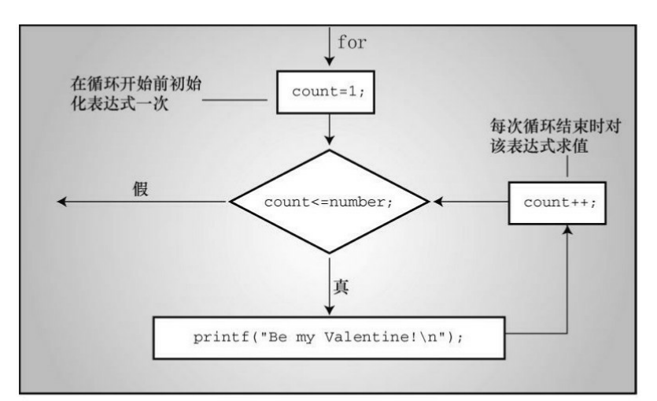
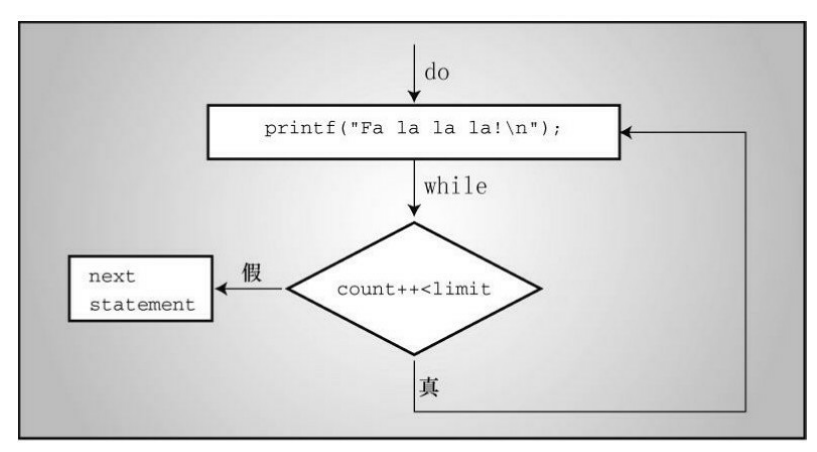

C语言有3种循环：while、do while、for。

# 为什么要用循环结构？

现在我们有这样一个需求，想要打印一个如下所示的图形：

```c
#
##
###
####
#####
```

用我们之前学习的方法来实现，代码如下：

```c
printf("#\n");
printf("##\n");
printf("###\n");
printf("####\n");
printf("#####\n");
```

按照以前学习的方法很容易打印出上面要求的图形，但是我们可以看到，其实这个过程没啥技术含量，完全是复制粘贴，然后在 printf 语句中添加一个 '#'，如果现在要我们打印 100 行的图形，难道还要一行一行的添加吗？即使你不嫌麻烦地写了 100 行代码，现在需求编程了打印 10000 行，你还要一行一行的写吗？

循环结构就为我们提供了解决这样的问题的方法。

# while 循环

## 1. 简介

我们来学习一下 while 循环。在学习之前，再体会一下不使用循环的局限性。

```c
#include <stdio.h> 
#define ADJUST 7.31 // 字符常量 
int main(void) 
{
    const double SCALE = 0.333;// const变量 
    double shoe, foot; 
    shoe = 9.0; 
    foot = SCALE * shoe + ADJUST; 
    printf("Shoe size (men's) foot length\n"); 
    printf("%10.1f %15.2f inches\n", shoe, foot); 
    return 0; 
}
```

上面的代码实现了将鞋码转换成英寸的功能，程序使用了乘法和加法，假定用户穿 9 码的鞋，以英寸为单位打印用户的脚长。你可能会说：“这太简单了，我用笔算比敲程序还要快。”说得没错。写出来的程序只使用一次（本例即只根据一只鞋的尺码计算一次脚长），实在是浪费时间和精力。如果写成交互式程序会更有用，但是仍无法利用计算机的优势。

计算机的优势就在于做一些重复计算的工作，我们使用 while 循环改进后的程序：

```c
#include <stdio.h> 
#define ADJUST 7.31 // 字符常量 
int main(void) 
{
    const double SCALE = 0.333;// const变量 
    double shoe, foot; 
    printf("Shoe size (men's) foot length\n"); 
    shoe = 3.0;
	while (shoe < 18.5) /* while循环开始 */ 
    {   /* 块开始 */ 
        foot = SCALE * shoe + ADJUST; 
        printf("%10.1f %15.2f inches\n", shoe, foot); 
        shoe = shoe + 1.0; 
    } /* 块结束 */ 
    printf("If the shoe fits, wear it.\n"); 
    return 0; 
}
```

下面是shoes2.c程序的输出（...表示并未显示完整，有删节）： 

**Shoe size (men's) foot length** 

**3.0 8.31 inches** 

**4.0 8.64 inches** 

**5.0 8.97 inches** 

**6.0 9.31 inches** 

**...** 

**16.0 12.64 inches** 

**17.0 12.97 inches** 

**18.0 13.30 inches** 

**If the shoe fits, wear it.** 


下面解释一下while循环的原理。当程序第 1 次到达 while 循环时，会检查圆括号中的条件是否为真。该程序中，条件表达式是：`shoe < 18.5`。变量 shoe 被初始化为 3.0，显然小于 18.5。因此，该条件为真，程序进入块中继续执行，把尺码转换成英寸。然后打印计算的结果。下一条语句把 shoe 增加 1.0，使 shoe 的值为 4.0： `shoe = shoe + 1.0; `此时，程序返回 while 入口检查条件。

为何要返回 while 的入口部分？因为上面这条语句的下面是右花括号(})，代码使用一对花括号({})来标出 while 循环的范围。**花括号之间的内容就是要被重复执行的内容。**花括号以及被花括号括起来的部分被称为块(block)。

现在，回到程序中。因为 4 小于 18.5，所以要重复执行被花括号括起来的所有内容(用计算机术语来说就是，程序循环这些语句)。该循环过程一直持续到 shoe 的值为 19.0。此时，由于 19.0 小于 18.5，所以该条件为假：

`shoe < 18.5 `出现这种情况后，控制转到紧跟 while 循环后面的第 1 条语句。该例中，是最后的 printf() 语句。

可以很方便地修改该程序用于其他转换。例如，把 SCALE 设置成 1.8、ADJUST 设置成 32.0，该程序便可把摄氏温度转换成华氏温度；把 SCALE 设置成 0.6214、ADJUST 设置成 0，该程序便可把公里转换成英里。注意，修改了设置后，还要更改打印的消息，以免前后表述不一。

## 2. while 语句

while 语句常用格式：

```c
while(循环条件表达式)
{
    循环执行的语句;
    循环条件更新;
}
```

写 while 循环的时候最重要的一点就是更新循环条件，否则，循环就不会停止，我们称之为死循环。(PS：事实上，不更新循环条件，也是可以通过 if 语句和 break 来终止循环的，这个在之后会讲，目前我们还只能通过更新循环条件，让循环条件表达式结果为假来终止循环)


考虑下面的例子：

```c
int i = 1;
while(i <= 5)
{
    printf("%d\n", i);
}
```

上面的程序段将打印无数次 1。为什么？因为循环中 i 的值一直都是原来的值 1，不曾变过。现在，考虑下面的程序段： 

```c
int i = 1;
while(--i <= 5)
{
    printf("%d\n", i);
}
```

这段程序也好不到哪里去。虽然改变了 i 的值，但是改错了！不过，这个版本至少在 i 减少到其类型到可容纳的最小负值并变成最大正值时会终止循环。

## 3. C 风格的读取循环

```c
int num;
while (scanf("%d", &num) == 1) 
{
    /*循环行为*/ 
}
```

上面的代码同时使用 scanf() 的两种不同的特性。首先，如果函数调用成功，scanf() 会把一个值存入 num。然后，利用 scanf() 的返回值（0或1，不是 num 的值）控制 while 循环。因为每次迭代都会判断循环的条件，所以每次迭代都要调用 scanf() 读取新的 num 值来做判断。换句话说，C 的语法特性让你可以用下面的精简版本替换标准版本： 当获取值和判断值都成功，处理该值。


利用 C 语言中非零值为真的特性，可以进一步精简，将循环条件表达式中的 == 1 省略。

```c
int num;
while (scanf("%d", &num)) 
{
    /*循环行为*/ 
}
```

## 4. 小测验

判断下面的几段代码是否存在问题？

**代码1：**

```c
int i = 0;
while(i = 3)
{
    printf("hello\n");
    i++;
}
```

**答案**：有问题，循环测试条件是一个赋值语句，而不是关系表达式，因此测试条件 `i = 3` 的值一直是 3，因此循环会一直进行，是死循环。应该将 `i = 3` 修改为 `i == 3` 或者 `i < 3`。


**代码2**：

```c
int i = 0;
while(i = 0)
{
    printf("hello\n");
    i++;
}
```

**答案**：不会出现死循环，并且循环语句永远不会被执行。因为循环条件表达式中赋值语句的值是 0，while 判断是假，不执行循环语句。

# 不确定循环和计数循环

一些 while 循环是不确定循环(indefinite loop)。所谓不确定循环，指在测试表达式为假之前，预先不知道要执行多少次循环。例如，C 风格的读取循环。我们事先并不知道用户会结束输入整数。另外，还有一类是计数循环(counting loop)。这类循环在执行循环之前就知道要重复执行多少次。下面的代码就是一个简单的计数循环。

```c
#include <stdio.h> 
int main(void) 
{
    const int NUMBER = 22; 
    int count = 1; // 初始化 
    while (count <= NUMBER) // 测试 
    {
        printf("Be my Valentine!\n"); // 行为 
        count++; // 更新计数 
    }
    return 0; 
}
```

虽然上面的代码运行情况良好，但是定义循环的行为并未组织在一起，程序的编排并不是很理想。我们来仔细分析一下。 


在创建一个重复执行固定次数的循环中涉及了3个行为： 

1. 必须初始化计数器； 
2. 计数器与有限的值作比较； 

1. 每次循环时递增计数器。 


while 循环的测试条件执行比较，递增运算符执行递增。代码中，递增发生在循环的末尾，这可以防止不小心漏掉递增。因此，这样做比将测试和更新组合放在一起(即使用 count++ <= NUMBER)要好，但是计数器的初始化放在循环外，就有可能忘记初始化。实践告诉我们可能会发生的事情终究会发生，所以我们来学习另一种控制语句 —— for 循环，可以避免这些问题。 

# for 循环

学习过 while 循环，我们再来接触一下 C 语言的另一种循环：for 循环。for 循环把上述3个行为(初始化、测试和更新)组合在一处。

```c
#include <stdio.h> 
int main(void) 
{
    const int NUMBER = 22; 
    for (int count = 1; count <= NUMBER; count++) 
        printf("Be my Valentine!\n"); 
    return 0; 
}
```

## 1. for 语句

for 语句常用格式：

```c
for(初始化语句;循环条件表达式;表达式更新)
{
    /*循环语句*/
}
```

关键字 for 后面的圆括号中有3个表达式，分别用两个分号隔开。第 1 个表达式是初始化，只会在 for 循环开始时执行一次。第 2 个表达式是测试条件，在执行循环之前对表达式求值。如果表达式为假时，循环结束。第 3 个表达式执行更新，在每次循环结束时求值。

for 圆括号中的表达式也叫做控制表达式，它们都是完整表达式，所以每个表达式的副作用(如，递增变量)都发生在对下一个表达式求值之前。




对于计数循环，for 循环的第一行包括了循环所需的所有信息：初始值，终值，每次循环的增量。

## 2. for 语句的灵活性

for 循环中的三个表达式给予了 for 循环对于计数循环很强的灵活性。

- 除了计数器递增，还可以使用递减运算符来递减计数器。

```c
for (secs = 5; secs > 0; secs--) 
```

- 可以让计数器每次递增、递减指定长度的增量，而不只是 1。

```c
for (n = 2; n < 60; n = n + 13) 
```

- 可以用字符代替数字计数。

```c
for (ch = 'a'; ch <= 'z'; ch++) 
```

- 除了测试迭代次数之外，还可以测试其他条件。

```c
for (num = 1; num*num*num <= 216; num++) 
```

- 可以让递增的量几何增长，而不是算术增长。

```c
for (debt = 100.0; debt < 150.0; debt = debt * 1.1) 
```

- 第3个表达式可以使用任意合法的表达式。无论是什么表达式，每次迭代都会更新该表达式的值。 

```c
for (x = 1; y <= 75; y = (++x * 5) + 50) 
```

- 可以省略一个或多个表达式(但是不能省略分号)，只要在循环中包含能结束循环的语句即可。

```c
for (n = 3; ans <= 25;) // 更新表达式放在了{}中
```

- 循环体中的行为可以改变循环头中的表达式。

# do while 循环

while 循环和 for 循环都是入口循环，即在循环的每次迭代之前检查测试条件，所以有可能根本不执行循环体中的内容。而 do while 循环是出口循环，即在循环的每次迭代之后检查测试条件，这保证了至少执行循环体中的内容一次。

```c
#include <stdio.h> 
int main(void) 
{
    const int secret_code = 13; 
    int code_entered; 
    do
    {
        printf("To enter the triskaidekaphobia therapy club,\n"); 
        printf("please enter the secret code number: "); 
        scanf("%d", &code_entered); 
    } while (code_entered != secret_code); 
    printf("Congratulations! You are cured!\n"); 
    return 0; 
}
```

下面是do while循环的通用形式： 

```c
do
    statement 
while ( expression );
```



# 如何选择循环

**首先，确定是需要入口条件循环还是出口条件循环**。通常，入口条件循环用得比较多。有几个原因，其一，一般原则是在执行循环之前测试条件比较好。其二，测试放在循环的开头，程序的可读性更高。其三，在许多应用中，要求在一开始不满足测试条件时就直接跳过整个循环。因此，我们通常是 while 循环和 for 循环中选择一个。

**那么，到底是选择 while 循环还是 for 循环**？这取决于个人喜好，因为二者皆可，要让 for 循环看起来像 while 循环，直接将第一个表达式和第三个表达式省略即可。要让 while 循环像 for 循环，直接在 while 前面初始化变量，在 while 循环体中包含更新语句。

一般而言，当循环涉及初始化和更新变量时(例如计数循环)，用 for 循环比较合适，而在其他情况下用 while 循环更好。

# 嵌套循环

还记得我们刚开始的打印图形的例子吗？

```c
#
##
###
####
#####
```

我们用之前学习的循环结构可以打印指定数目的 '#' 字符了。

```c
for(int i = 0; i < n; i++)
    printf("#");
```

其中 n 是指定打印几个 '#' 字符。

如果想要打印上面指定的图形，就需要用到嵌套循环了。

```c
int i = 0, j = 0;
int n = 5;
while(i < n)
{
    j = 0;
    while(j <= i)
    {
    	printf("#");
        j++;
    }
    printf("\n");
    i++;
}
```

​	如果我们想要打印 100 行图形，只需要将 n 修改为 100 即可。